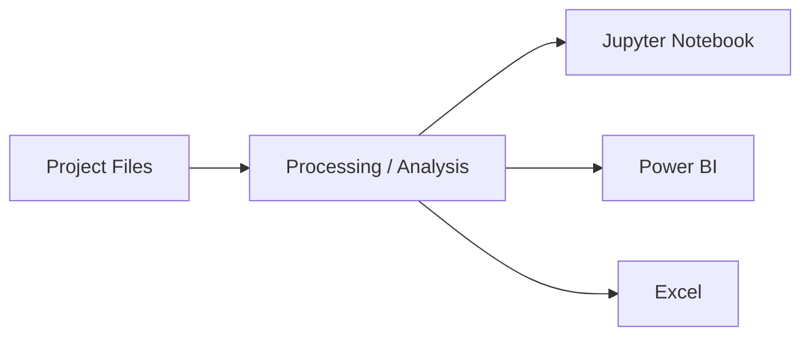

<div align="center">

# European Energy Market Analysis

### Evidence-based project documentation generated from the repository contents

[](https://github.com/gawandeshil03-ops/energy-utilities-analytics-portfolio) [](https://github.com/gawandeshil03-ops/european-energy-market-analysis-portfolio) [](https://www.linkedin.com/in/shilgawande2004) [](https://github.com/gawandeshil03-ops)

[](https://jupyter.org/) [](https://powerbi.microsoft.com/) [](https://www.microsoft.com/microsoft-365/excel)

</div>

---

## Project Overview

This repository presents European Energy Market Analysis using evidence found in the project files, with detected technologies including Jupyter Notebook, Power BI, Excel.

## Architecture / Workflow



## Key Features

- Includes Jupyter notebooks for reproducible analysis or experimentation.
- Includes a Power BI report/dashboard asset.
- Includes Excel workbooks used as inputs, analysis assets, or outputs.

## Technology Stack

| Technology | Evidence / Purpose |
|---|---|
| Jupyter Notebook | Detected from repository files |
| Power BI | Detected from repository files |
| Excel | Detected from repository files |

## Repository Structure

```text
european-energy-market-analysis-portfolio/
|-- European-Energy-Market-Analysis/
```

## Security / Data Safety

Before publication, the automation checks for common credential files, obvious private-key/token patterns, nested Git metadata, and oversized files. Original local project folders are not modified.

## Suggested Enhancements

- Add further project-specific documentation as the implementation evolves.
- Add tests or validation assets where appropriate.
- Add screenshots or output examples when they can be verified from the project.

## Portfolio Contact

**Shil Gawande**  
[LinkedIn](https://www.linkedin.com/in/shilgawande2004) | [GitHub](https://github.com/gawandeshil03-ops) | [gawandeshil9@gmail.com](mailto:gawandeshil9@gmail.com) | +91 9172937014

---

[Return to Main Portfolio](https://github.com/gawandeshil03-ops/energy-utilities-analytics-portfolio)
